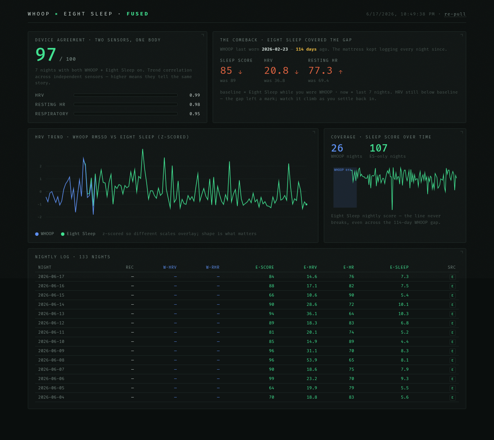

# dashboard — WHOOP × Eight Sleep, fused

The instrument panel neither app gives you: two independent sensors (WHOOP wrist
strap, Eight Sleep mattress) measuring the same sleep, lined up night by night.



## What it shows

- **Device agreement** — how well WHOOP and Eight Sleep agree on HRV, resting
  HR, and respiratory rate over the nights you wore both. Trend correlation
  across independent hardware; ~0.97 in practice. The cross-validation no single
  app can do.
- **The comeback** — Eight Sleep logs every night with zero effort, so it covers
  any WHOOP gap. Compares your metrics from when you last wore WHOOP against now.
- **HRV trend** — WHOOP RMSSD and Eight Sleep HRV, z-scored so two different
  scales overlay; the *shape* agreeing is the point.
- **Coverage** — sleep score over time, with the WHOOP-active era marked. The
  line never breaks even across the gap.
- **Nightly log** — every night, both sources, dense and sortable by eye.

## Run it

```bash
# from the repo root — starts a persistent background server
tools/serve.sh start dashboard
# open http://127.0.0.1:8787
tools/serve.sh logs dashboard     # tail logs
tools/serve.sh stop dashboard
```

The server caches both pulls to `.cache/data.json` (gitignored — it's your
biometric data) for 30 min. Hit **re-pull** in the UI or `?refresh=1` to force a
fresh pull.

## How it fits together

- `dashboard/data.py` — pulls WHOOP + Eight Sleep, caches to disk.
- `dashboard/fusion.py` — aligns records into per-night `FusedNight`s (keyed by
  local SF date), computes the trust and comeback reports.
- `dashboard/app.py` — Flask: serves `/api/summary` (JSON) and the static SPA.
- `static/index.html` — self-contained frontend (vanilla JS + canvas, no build).

_Built by claude._
